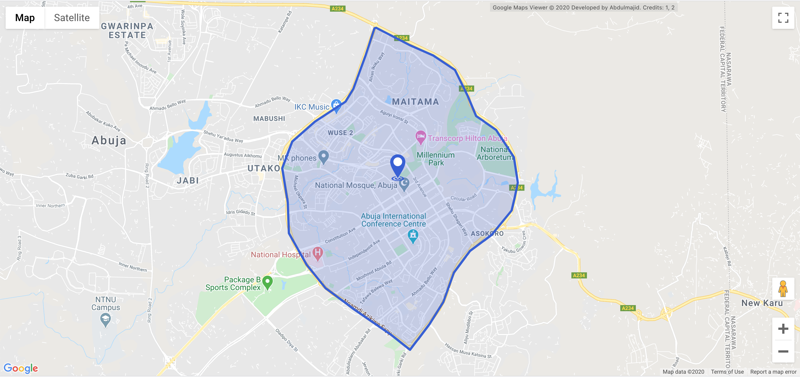

  

# React Map Render 
[]
> A simple react app that renders different map data passed to it as query parameters on a Google Map layer. Components that can be rendered included polygon, polyline and markers

# Getting Started
You can view a live demo at https://react-map-render.surge.sh

To get the app running:
1. Clone the repository
2. Run `npm install` to install all the required dependencies
3. Run `npm start` to start the local server
Note: This project uses [Create React App](https://github.com/facebook/create-react-app)

# Usage Guide
To create a embeddable link, simply provide the required parameters as part of the url:

| **Key**    | **Default**  | **Description**                                                                                                                                                                                                                                                                                        |
|------------|--------------|--------------------------------------------------------------------------------------------------------------------------------------------------------------------------------------------------------------------------------------------------------------------------------------------------------|
| `zoom`     | 3            | This is the zoom level to which the map will be displayed. Ranges from 0 (min) to 22 (max). For `geocoord` and `coord` and multiple                                                                                                                                                                    |
| `points`   |              | This is the zoom level to which the map will be displayed. Ranges from 0 (min) to 22 (max). For  `geocoord` and `coord` and multiple `points`. If no zoom level is provided, the location bounds are used.                                                                                             |
| `center`   | 3.444,3.4444 | This is the initial center of the map. For `geocoord` and `coord` and multiple `points`, If no center is provided, the center of the location bounds are used.                                                                                                                                         |
| `coord`    |              | Pipe separated latitude/longitude pair. Example: `9.11058245073946,7.480727975272465\|9.10227706021901,7.477981393241215\|9.092106931589456,7.474204842948247\|9.088208305665116,7.471801583670903`. This displays the points on the map as a dotted polyline                                          |
| `geocoord` |              | Pipe separated latitude/longitude pair. Example: `9.11058245073946,7.480727975272465\|9.10227706021901,7.477981393241215\|9.092106931589456,7.474204842948247\|9.088208305665116,7.471801583670903`. This displays the points on the map as a continuous polygon filled with a transparent blue colour |
| `points`   |              | Pipe separated latitude/longitude pair. Example: `9.11058245073946,7.480727975272465\|9.10227706021901,7.477981393241215\|9.092106931589456,7.474204842948247\|9.088208305665116,7.471801583670903`. This displays the points on the map as a markers on every point                                   |
| `maptype`  | roadmap      | This can either be `roadmap`, `terrain`, `hybrid` or `satellite` and determines the map layer used |
| `apikey`   |              | Since Google requires an API key to access Google Maps (without which a watermark is displayed over the map layer), visit [Get API Key](https://developers.google.com/maps/documentation/javascript/get-api-key) to create one                                                                         |

## Examples
| **Description**                      | **URL**                                                                                                                                                                                                                                                                                                                                                                                                                                                                                                                                                                                                                                                                                                                                                                                                                                                                                                                                                                                                                                                                                                                            |
|--------------------------------------|------------------------------------------------------------------------------------------------------------------------------------------------------------------------------------------------------------------------------------------------------------------------------------------------------------------------------------------------------------------------------------------------------------------------------------------------------------------------------------------------------------------------------------------------------------------------------------------------------------------------------------------------------------------------------------------------------------------------------------------------------------------------------------------------------------------------------------------------------------------------------------------------------------------------------------------------------------------------------------------------------------------------------------------------------------------------------------------------------------------------------------|
| Polygon with a marker at it's center | https://react-map-render.surge.sh/?geocoord=9.11058245073946,7.480727975272465\|9.10227706021901,7.477981393241215\|9.092106931589456,7.474204842948247\|9.088208305665116,7.471801583670903\|9.082106023381849,7.462360207938481\|9.076003637204174,7.455322091483403\|9.06786696080368,7.452232186698247\|9.05735681419275,7.453948800467778\|9.048033039774012,7.454292123221684\|9.038369964055587,7.459785287284184\|9.031249637096655,7.46562177410059\|9.024807315319858,7.4743765043252\|9.017008561346579,7.485877816581059\|9.012430953375835,7.491714303397465\|9.020229806241822,7.497722451590825\|9.027011280458105,7.502013986014653\|9.035996537369947,7.505275552176762\|9.042608187092915,7.510253732108403\|9.047524463308974,7.516948525809575\|9.054983512732594,7.523128335379887\|9.06345951740757,7.525016610526372\|9.071257265058717,7.5238149808877\|9.079563375096665,7.5183218168252\|9.083801112218262,7.512142007254887\|9.089903365629993,7.50956708660059\|9.097870039970381,7.5056188749306685\|9.10227706021901,7.498924081229497\|9.105497540673266,7.491542642020512\|9.110751946495554,7.481242959403325 |
| Polyline                             | https://react-map-render.surge.sh/?coord=9.11058245073946,7.480727975272465\|9.10227706021901,7.477981393241215\|9.092106931589456,7.474204842948247\|9.088208305665116,7.471801583670903\|9.082106023381849,7.462360207938481\|9.076003637204174,7.455322091483403\|9.06786696080368,7.452232186698247\|9.05735681419275,7.453948800467778\|9.048033039774012,7.454292123221684\|9.038369964055587,7.459785287284184\|9.031249637096655,7.46562177410059\|9.024807315319858,7.4743765043252\|9.017008561346579,7.485877816581059\|9.012430953375835,7.491714303397465\|9.020229806241822,7.497722451590825\|9.027011280458105,7.502013986014653\|9.035996537369947,7.505275552176762\|9.042608187092915,7.510253732108403\|9.047524463308974,7.516948525809575\|9.054983512732594,7.523128335379887\|9.06345951740757,7.525016610526372\|9.071257265058717,7.5238149808877\|9.079563375096665,7.5183218168252\|9.083801112218262,7.512142007254887\|9.089903365629993,7.50956708660059\|9.097870039970381,7.5056188749306685\|9.10227706021901,7.498924081229497\|9.105497540673266,7.491542642020512\|9.110751946495554,7.481242959403325    |
| Cluster of markers                   | https://react-map-render.surge.sh/?points=9.11058245073946,7.480727975272465\|9.10227706021901,7.477981393241215\|9.092106931589456,7.474204842948247\|9.088208305665116,7.471801583670903\|9.082106023381849,7.462360207938481\|9.076003637204174,7.455322091483403\|9.06786696080368,7.452232186698247\|9.05735681419275,7.453948800467778\|9.048033039774012,7.454292123221684\|9.038369964055587,7.459785287284184\|9.031249637096655,7.46562177410059\|9.024807315319858,7.4743765043252\|9.017008561346579,7.485877816581059\|9.012430953375835,7.491714303397465\|9.020229806241822,7.497722451590825\|9.027011280458105,7.502013986014653\|9.035996537369947,7.505275552176762\|9.042608187092915,7.510253732108403\|9.047524463308974,7.516948525809575\|9.054983512732594,7.523128335379887\|9.06345951740757,7.525016610526372\|9.071257265058717,7.5238149808877\|9.079563375096665,7.5183218168252\|9.083801112218262,7.512142007254887\|9.089903365629993,7.50956708660059\|9.097870039970381,7.5056188749306685\|9.10227706021901,7.498924081229497\|9.105497540673266,7.491542642020512\|9.110751946495554,7.481242959403325   |